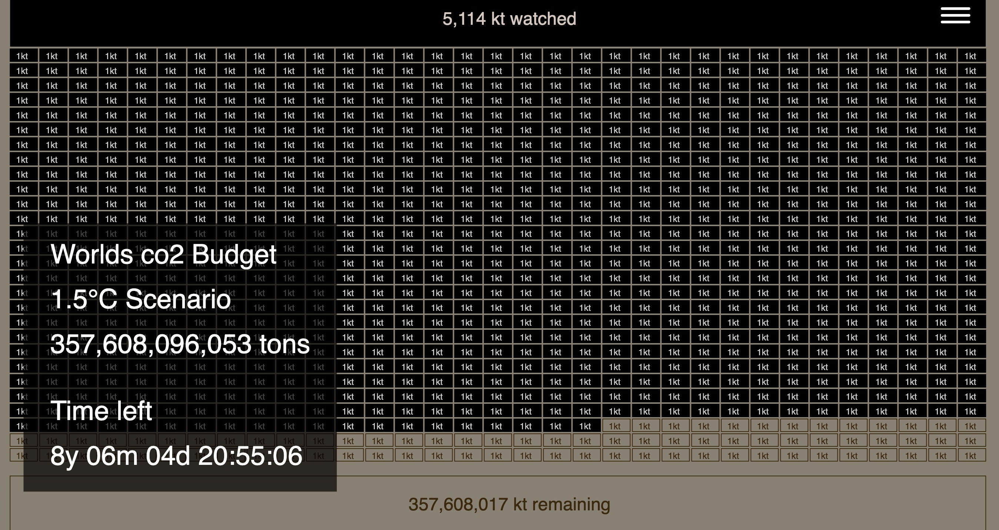
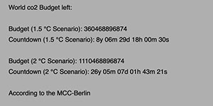

# p5.co2Budget.js
### This library opens up the idea of the CO2-countdown to creative communities of coderer, designers and artists using the p5*js project.

**p5.co2Budget Library**
- based on Carbon-Clock
- by Mercator Research Institute on Global Commons and Climate Change (MCC) gGmbH
- https://www.mcc-berlin.net/fileadmin/data/clock/carbon_clock.htm
- Version 1.0 | 02.06.2019
- by Olaf Val
- CC BY 4.0 

### Embed the p5.co2Budget.js library online to stay up-to-date automatically.
http://projects.olafval.de/co2-budget/p5.co2Budget.js

		Place this line in the header of your html code:
		<script src="http://projects.olafval.de/co2-budget/p5.co2Budget.js"></script>
	
### Download the library package as ZIP-File:
- Sign up to receive updates in case the research data should change!
- [Newsletter](https://mailchi.mp/466342f40b18/p5co2budgetjs)


## Reference

**Syntax:**
```javascript
co2Budget(s, agr).budget
co2Budget(s, agr).years
co2Budget(s, agr).months
co2Budget(s, agr).days
co2Budget(s, agr).hours
co2Budget(s, agr).minutes
co2Budget(s, agr).seconds
```
**Parameters:**
```javascript
s = Scenario (1.5 or 2)
agr = Annual Growth Rate (1)
```


## Examples

  
**Basic** [view](http://projects.olafval.de/co2-budget/examples/basic.html)

  
**co2Clipart** [view](http://projects.olafval.de/co2-budget/examples/co2Clipart.html)

  
**co2DataVisualization** [view](http://projects.olafval.de/co2-budget/examples/co2DataVisualization.html)

<br>
