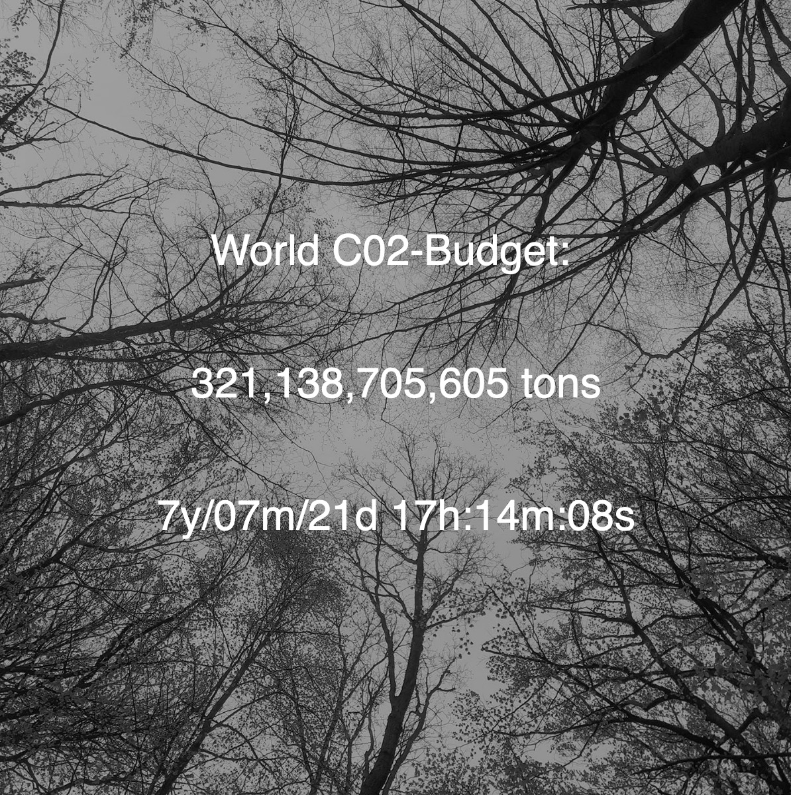
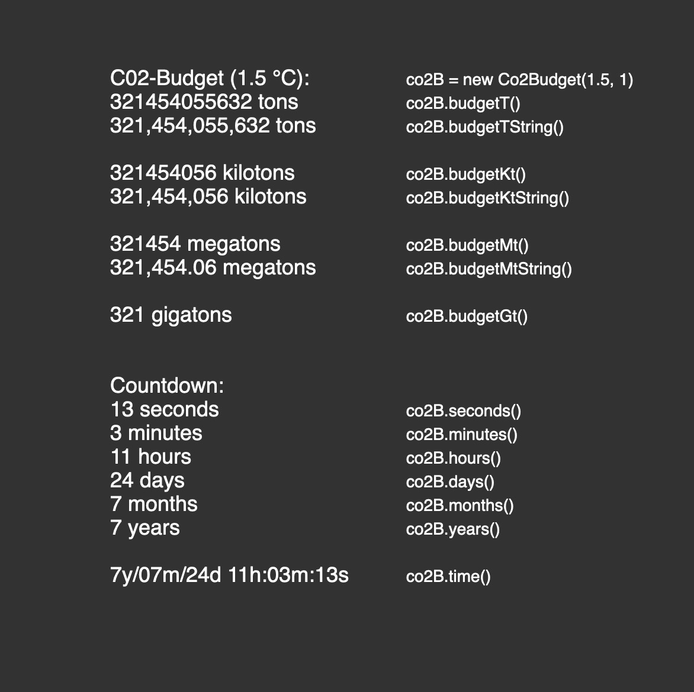

# Co2Budget.js
### This library opens up the idea of the CO2-Countdown to creative communities of coders, designers and artists associated with [p5*js](https://p5js.org) and JavaScript.

**Co2Budget Library**
- based on Carbon-Clock
- by Mercator Research Institute on Global Commons and Climate Change (MCC) gGmbH
- https://www.mcc-berlin.net/fileadmin/data/clock/carbon_clock.htm
- Version 1.5 | 07.05.2020
- by Olaf Val
- CC BY 4.0 

The MCC-Berlin has changed its formality a bit recently, I will adapt the CO2Budget.js to this as soon as possible. 


## Reference

**Syntax:**
```javascript
co2B = new Co2Budget(s, agr);

co2B.budgetT()
co2B.budgetTString()

co2B.budgetKt()
co2B.budgetKtString()

co2B.budgetMt()
co2B.budgetMtString()

co2B.budgetGt()

co2B.time()
co2B.years()
co2B.months()
co2B.days()
co2B.hours()
co2B.minutes()
co2B.seconds()
```
**Parameters:**
```javascript
s = Scenario (1.5 or 2)
agr = Annual Growth Rate (1)
```


### Embed the Co2Budget.js library online to stay up-to-date automatically!
(Linking from GitHub doesn’t work in p5js online editor currently.)
https://raw.githubusercontent.com/OlafVal/Co2Budget.js/master/Co2Budget.js

		Place this line in the header of your html code:
		<script src="https://raw.githubusercontent.com/OlafVal/Co2Budget.js/master/Co2Budget.js"></script>

or

### Download the library package as ZIP-File:
(Recommended for the p5js online editor.)
- Sign up to receive updates in case the research data should change!
- [Newsletter](https://mailchi.mp/466342f40b18/p5co2budgetjs)


## Examples


 **Co2-Budget-Basic** [view](http://projects.olafval.de/co2-budget/co2-budget-basic.html) / [code](/Examples/co2-budget-basic.js)

 **Commands** [view](http://projects.olafval.de/co2-budget/commands.html) / [code](/Examples/commands.js)

<br>

### *Check out* 
*the multifaceted designs others have already developed for the CO2 countdown! I am also happy to publish your contribution on the [Co2Budget.js-project-page](http://projects.olafval.de/p5-co2budget-js/).*
